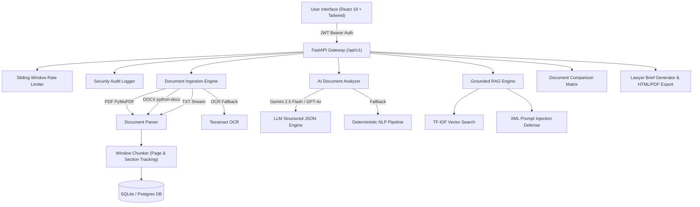

# NyayaLens – AI Legal Information & Document Assistance Platform

[](LICENSE)
[](https://python.org)
[](https://react.dev)
[](https://fastapi.tiangolo.com)

**NyayaLens** is a production-quality, full-stack AI legal-document assistant designed to help ordinary users understand, compare, analyze, and navigate complex legal agreements, and effectively prepare for consultations with qualified legal professionals.

---

## 🛑 Important Legal Safety Boundary & Disclosure

> [!IMPORTANT]
> **NyayaLens provides legal information and document assistance for educational purposes only. It does NOT replace professional legal advice or formal legal representation.**
> 
> **Core Safety Directives Enforced:**
> 1. Never claims to be a lawyer or law firm.
> 2. Never presents AI outputs as definitive legal advice.
> 3. Uses neutral risk framing (*"Potential Concern"*, *"Requires Review"*, *"Information Gap"*).
> 4. Embeds non-advice preparation disclaimers across all pages, exports, and API responses.

---

## 🏛️ System Architecture



---

## ✨ Complete Feature Matrix (10 Core Modules)

1. **Document Ingestion Pipeline**: PDF, DOCX, and TXT upload (up to 15MB) with drag-and-drop, automated OCR fallback, page tracking, and section header detection.
2. **AI Document Analyzer & 14-Category Clause Radar**: Extracts document type, executive summary, parties, monetary terms, dates, obligations, rights, and 14 clause taxonomy categories.
3. **Grounded RAG Q&A ("Ask Your Document")**: TF-IDF similarity vector ranking, prompt injection protection (`<untrusted_document_evidence>` XML isolation), strict page/section citations, and insufficient information fallback.
4. **Potential Concern Detector**: Identifies ambiguous clauses, broad obligations, automatic renewal traps, and missing information using non-judgmental risk levels.
5. **Legal Timeline Extractor**: Chronological event timeline displaying payment deadlines, notice periods, and renewal windows with source page links.
6. **Action Checklist**: Generates prioritized preparation items separating **Document-Derived Actions** from **General Preparation Suggestions** with completion toggles.
7. **Document Comparison Workbench**: 12-category side-by-side matrix comparing two agreements to surface changed values, missing clauses, and inconsistencies.
8. **Lawyer Brief Generator & Export**: Consultation preparation document builder with live inline text editing and print-ready PDF/HTML export.
9. **Document History & Archive**: User-isolated document table with status filters, chunk count, search bar, and secure deletion modal.
10. **Multilingual Engine (i18n)**: Supports **English**, **Hindi (हिन्दी)**, and **Marathi (मराठी)** across UI components and AI outputs.

---

## 🚀 Quick Setup & Installation

### Prerequisites
- Python 3.10+
- Node.js 18+ & npm

### 1. Backend Setup
```bash
cd backend

# Create & activate virtual environment
python -m venv venv
.\venv\Scripts\Activate.ps1    # On Windows PowerShell
# source venv/bin/activate      # On Linux/macOS

# Install dependencies
pip install -r requirements.txt

# Run backend server
uvicorn app.main:app --reload --port 8000
```
Interactive API documentation: `http://127.0.0.1:8000/docs`.

### 2. Frontend Setup
```bash
cd frontend

# Install node dependencies
npm install

# Build & run development server
npm run dev
```
Frontend Web Application: `http://localhost:5173`.

---

## 📡 Complete REST API Documentation (v1)

| Method | Endpoint | Description | Auth Required |
| :--- | :--- | :--- | :--- |
| `GET` | `/api/v1/health` | Health check & system status | No |
| `POST` | `/api/v1/auth/register` | Register new user account | No |
| `POST` | `/api/v1/auth/login` | Authenticate & obtain JWT bearer token | No |
| `GET` | `/api/v1/auth/me` | Fetch authenticated user profile | Yes |
| `POST` | `/api/v1/documents/upload` | Upload PDF/DOCX/TXT file & chunk text | Yes |
| `GET` | `/api/v1/documents` | List user's uploaded document history | Yes |
| `GET` | `/api/v1/documents/{id}` | Get document details & chunk extractions | Yes |
| `DELETE` | `/api/v1/documents/{id}` | Delete document and associated records | Yes |
| `GET` | `/api/v1/documents/{id}/analysis` | Trigger or fetch AI document analysis | Yes |
| `GET` | `/api/v1/documents/{id}/clauses` | Filter clauses by category | Yes |
| `GET` | `/api/v1/documents/{id}/concerns` | Fetch potential concerns & findings | Yes |
| `POST` | `/api/v1/documents/{id}/ask` | Ask grounded RAG question on document | Yes |
| `GET` | `/api/v1/documents/{id}/timeline` | Extract chronological event timeline | Yes |
| `GET` | `/api/v1/documents/{id}/checklist` | Fetch actionable next-steps checklist | Yes |
| `POST` | `/api/v1/documents/compare` | Side-by-side comparison of two documents | Yes |
| `GET` | `/api/v1/documents/{id}/brief` | Generate lawyer consultation brief | Yes |
| `GET` | `/api/v1/documents/{id}/brief/export` | Export brief to print-ready HTML/PDF | Yes |

---

## 📁 Sample Documents for Evaluators

Pre-packaged sample legal documents are provided in `backend/samples/` for rapid evaluation:
- `backend/samples/employment_agreement.pdf` (PDF format sample)
- `backend/samples/sample_nda_agreement.docx` (DOCX format sample)
- `backend/samples/rental_agreement.txt` (TXT format sample)

---

## 🔒 Security & Privacy Features

- **Rate Limiting**: Sliding window rate limiter preventing API abuse (100 requests/minute).
- **Audit Logging**: Structured JSON logging of user authentication, uploads, and deletions in `backend/logs/audit.log`.
- **Data Isolation**: Multi-tenant database separation enforcing `user_id` query filters on all resources.
- **Prompt Injection Defense**: Untrusted text from uploaded documents is sanitized via regex patterns and isolated inside `<untrusted_document_evidence>` XML tags before LLM processing.
